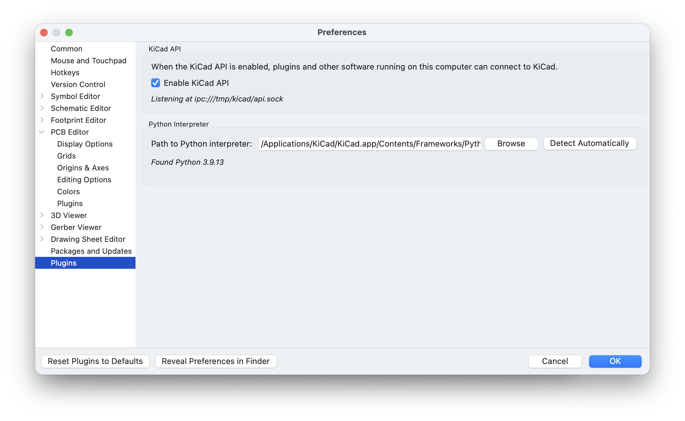
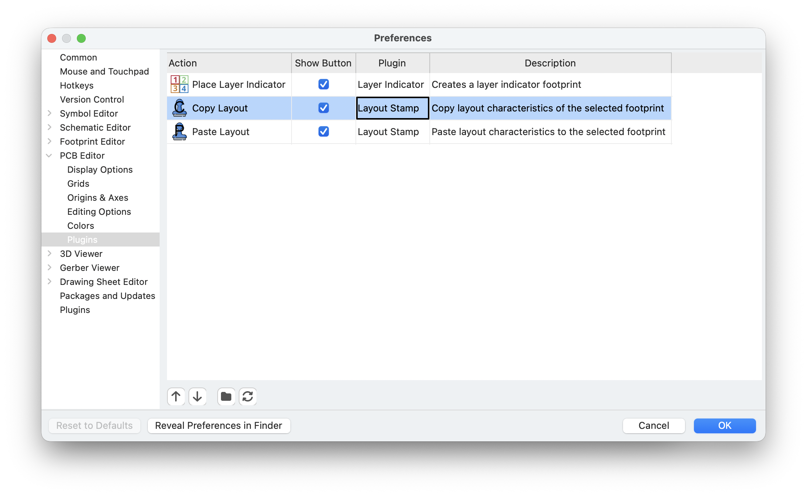

# Layout Stamp - KiCad Plugin

    Note this plugin is currently only for demonstration.
    
    It has not been widely tested or designed for ease of use. 
    It may be used as a starting point, but is not guaranteed to be useful or safe!

The **Layout Stamp** plugin allows you to layout the fields of a footprint in the KiCad PCB editor, and then copy that work to other instances of the same footprint.

The plugin will copy characteristics such as visibility, orientation, size, knockout and relative position.

## Compatibility
This plugin uses the new IPC API in KiCad 9. It has been tested to work on 9.0.4 and 9.0.5 on Mac.

The IPC API is not currently enabled by default! You must enable by checking the box in the "Plugins" section of KiCad's settings.

## Installation
While the IPC API is new, plugin installation may not be simple. For now, you can just download this project from GitHub, and move the whole folder in your plugins folder. KiCad will automatically register the plugin when it starts.

Typical plugins folder locations:

- macOS: `/Users/<username>/Documents/KiCad/<version>/plugins`
- Linux: `~/.local/share/KiCad/<version>/plugins`
- Windows: `C:\Users\<username>\Documents\KiCad\<version>\plugins`

For details, see the [developer docs](https://dev-docs.kicad.org/en/apis-and-binding/ipc-api/for-addon-developers/index.html#_plugin_action_registration).

You can confirm installation by looking in the "PCB Editor -> Plugins" section of KiCad's settings.

The copy and paste buttons will then appear in the PCB editor (`pcbnew`) toolbar.

## Licence and credits

Plugin code licensed under MIT, see `LICENSE` for more info.

 - Icon from flaticon.com: <a href="https://www.flaticon.com/free-icons/clone-stamp" title="clone stamp icons">Clone stamp icons created by Freepik - Flaticon</a>

### Useful References

This functionality was prototyped using the legacy KiCad API. Since that API is generally better understood at the moment, comparing this project to the prototype provides insight into the new IPC API. The prototype can be found [here](doc/legacy_api-replicate_properties.txt).

References used to guide development:

- [PCB Editor | 9.0 | English | Documentation | KiCad](https://docs.kicad.org/9.0/en/pcbnew/pcbnew.html#multichannel),
- [Writing and publishing a plugin - External Plugins - KiCad.info Forums](https://forum.kicad.info/t/writing-and-publishing-a-plugin/38830),
- [kicad-swap-footprints/swap_components.py at main · JarrettR/kicad-swap-footprints](https://github.com/JarrettR/kicad-swap-footprints/blob/main/swap_components.py)
- [MitjaNemec/ReplicateLayout at V9](https://github.com/MitjaNemec/ReplicateLayout/tree/V9)
- [KiCad / KiCad Source Code / KiCad API Python Bindings · GitLab](https://gitlab.com/kicad/code/kicad-python)
- [For Add-on Developers | Developer Documentation | KiCad](https://dev-docs.kicad.org/en/apis-and-binding/ipc-api/for-addon-developers/index.html)
